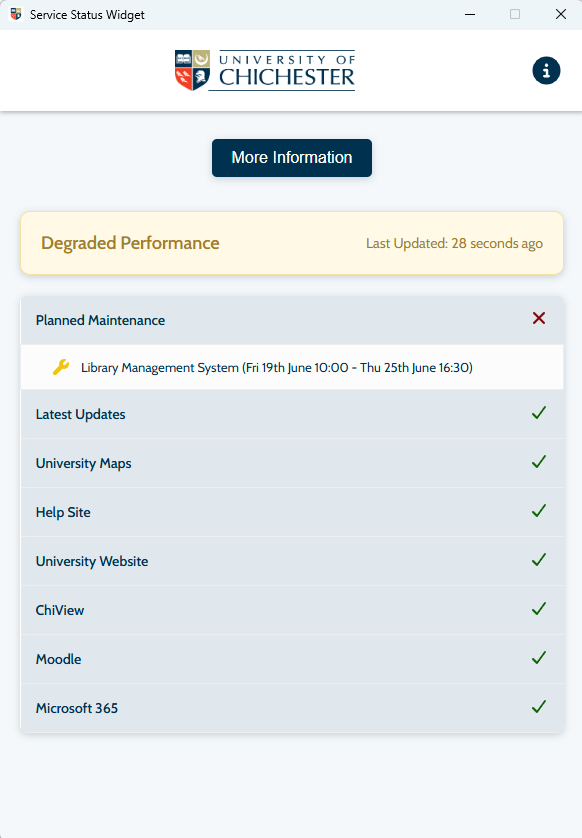
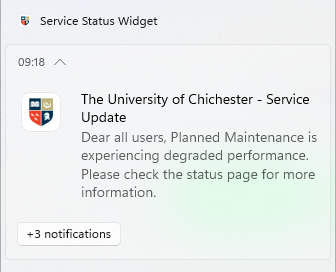

# Service Status Desktop Widget

> **Portfolio Showcase**
> This repository showcases a desktop application developed during my Digital Technology Solutions Degree Apprenticeship at the University of Chichester.
>
> The source code is not publicly available as it was developed during my employment and remains the intellectual property of the University of Chichester.

---

# Project Overview

The Service Status Desktop Widget was developed to improve communication with university staff and students during service outages and planned maintenance.

The university already used a third-party incident management platform to monitor and publish service status updates. However, users were required to manually visit the website to view the current status of services, resulting in low visibility of incidents.

To address this, I designed and developed a cross-platform desktop widget that provided real-time service status information directly on users' desktops, along with native operating system notifications whenever the status of a service changed.

The application was deployed across both Windows and macOS devices throughout the university.

---

# Background

A significant challenge during the project was that the third-party incident management platform imposed strict API rate limits.

If every desktop application queried the API directly, the request limit would quickly be exceeded.

To overcome this, I designed a lightweight middleware service in Python that periodically retrieved the latest service status from the third-party API.

The Electron desktop application then communicated with this internal service rather than the external platform, dramatically reducing API usage while ensuring all users received timely updates.

This architecture improved scalability, reduced unnecessary API requests and provided a better user experience.

---

# System Architecture

```text
Third-Party Incident Management Platform
                │
                │ Scheduled API Requests
                ▼
        Python Middleware Service
      (Polling / Caching / Processing)
                │
                │ Internal API
                ▼
     Electron Desktop Application
                │
                ▼
 Windows & macOS Desktop Notifications
```

---

# Key Features

## Desktop Widget

* Live service status display
* Cross-platform support
* Native Windows notifications
* Native macOS notifications
* Automatic refresh
* Lightweight desktop interface

## Middleware Service

* Scheduled polling of third-party API
* API response caching
* Reduced API usage
* Internal API for desktop clients
* Improved scalability

---

# Technologies Used

## Desktop Application

* Electron
* HTML
* CSS
* JavaScript

## Middleware

* Python
* REST APIs

---

# My Contribution

I was responsible for the design and development of the solution, including:

* Designing the overall system architecture
* Developing the Python middleware service
* Integrating with the third-party REST API
* Implementing API caching and scheduled polling
* Developing the Electron desktop application
* Implementing native desktop notifications
* Testing on Windows and macOS
* Supporting deployment across the university

---

# Skills Demonstrated

This project demonstrates experience with:

* Desktop application development
* Electron
* Python
* REST API integration
* System architecture
* Middleware development
* API optimisation
* Cross-platform development
* Notification systems
* Production software deployment

---

# Technical Challenges

One of the primary technical challenges was working within the API request limits imposed by the third-party service.

Rather than allowing every desktop client to communicate directly with the external API, I introduced an intermediary Python service responsible for:

* Polling the API at fixed intervals
* Processing service status updates
* Providing a single internal endpoint for all desktop clients

This significantly reduced the number of external API requests while ensuring users continued to receive near real-time updates.

---

# Screenshots

## Desktop Widget



## Desktop Notification



---

# What I Learned

This project strengthened my understanding of:

* Designing scalable software architectures
* API integration
* Managing third-party service limitations
* Desktop application development with Electron
* Cross-platform software development
* Middleware design
* User notification systems
* Delivering software for production environments

---

# Project Outcome

The application was successfully deployed across university-managed Windows and macOS devices, providing users with immediate visibility of service disruptions without requiring them to visit the third-party status website.

By introducing a Python middleware layer, the solution remained within the third-party API limits while delivering timely service status updates to users across the organisation.

---

# Repository Purpose

Although the source code cannot be made publicly available, this repository showcases one of the production applications I developed during my Degree Apprenticeship.

The project demonstrates my experience designing scalable software solutions, integrating third-party services and delivering cross-platform desktop applications for real users.
